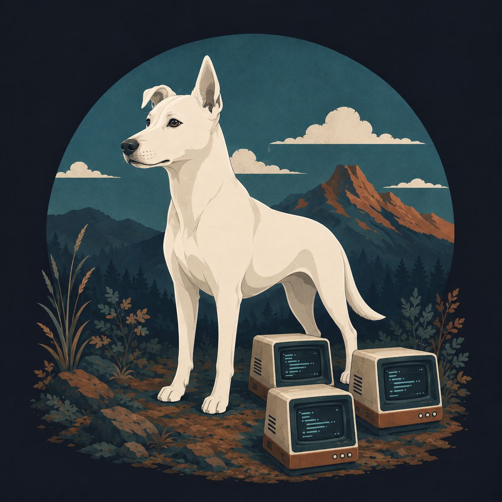
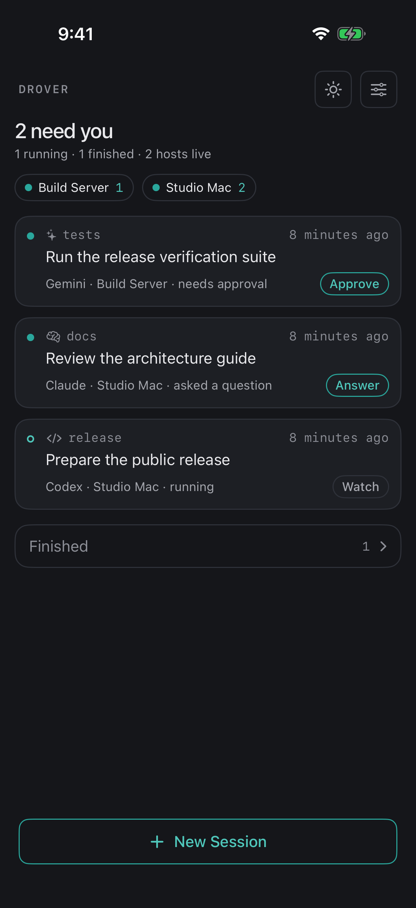
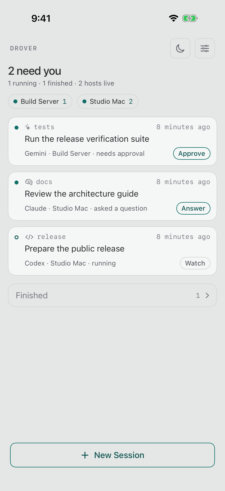
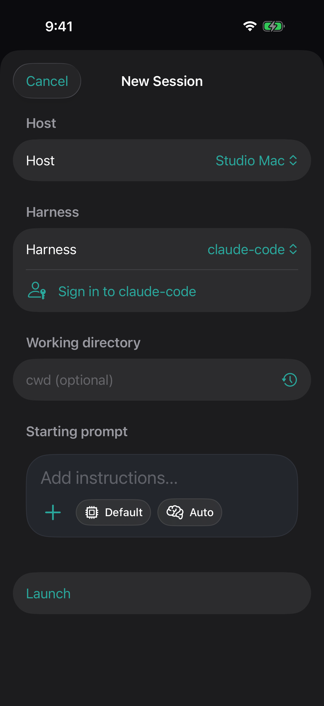
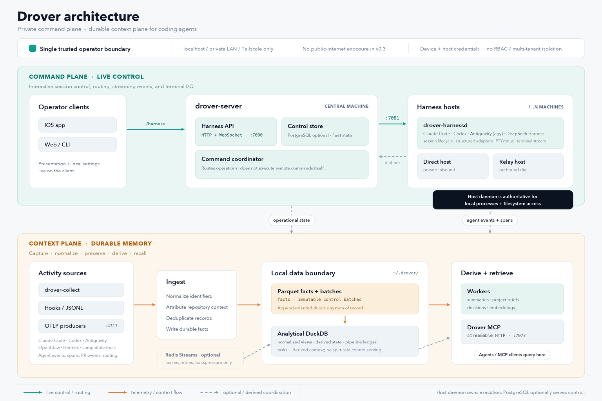

# Drover

<p align="center">
  
</p>

> Drive your coding-agent fleet from your pocket.

## What Drover is

Drover is a local-first cockpit and context store for a personal fleet of CLI
coding agents. It connects Claude Code, Codex, Gemini, OpenClaw, and compatible
harnesses running on machines you control. A native iOS client lets you inspect
sessions, answer prompts, send turns, hand work off, and attach to a terminal.

Drover is self-hosted software for one trusted operator. The supported v0.1
network boundary is localhost, a private LAN, or a private Tailscale network.
It does not require a Drover cloud service.

## Screenshots

<p align="center">
  
  
  
</p>

The fleet view groups live work by host and brings approvals and questions to
the top. One palette contract covers both themes, and the control beside the
wordmark switches between them. The launch sheet selects a host and harness,
checks authentication, and carries model and reasoning preferences into the
new session.

## How it works



- The **command plane** connects the iOS app to `drover-server` and per-host
  `drover-harnessd` daemons for session control, structured chat, approvals,
  handoff, and terminal streaming.
- The **context plane** collects durable agent events and spans into local
  Parquet and DuckDB storage, then derives summaries, project briefs, and
  embeddings for recall.
- The **MCP surface** exposes that context to coding agents as `drover_*` tools.

See [Architecture](docs/architecture.md) for the component boundaries and
[Context Store](docs/context-store.md) for the data model.

## Quickstart

Requires Python 3.11+ and [uv](https://docs.astral.sh/uv/).

```bash
git clone https://github.com/arniesaha/drover.git
cd drover
uv sync --extra dev
uv run drover-server init
uv run drover-server run
```

In another terminal, start a local harness host:

```bash
uv run drover-harnessd \
  --host-id local \
  --kind macos \
  --central-url http://127.0.0.1:7080 \
  --local-url http://127.0.0.1:7081
```

`init` enables the local cockpit on `127.0.0.1:7080`. The first server start
creates `~/.drover/api_token` with mode `0600`. Use
that token when configuring the iOS app or calling the harness API.

Continue with [Getting Started](docs/getting-started.md) for verification,
private Tailscale setup, and optional context ingestion.

## Context store

Raw agent events and OpenTelemetry spans are durable facts. Drover stores them
as partitioned Parquet, exposes normalized DuckDB views, and keeps mutable
derived context such as summaries, briefs, embeddings, and job provenance in
DuckDB. Derived records always retain links back to source sessions or spans.

The model and its compatibility boundary are documented in
[Context Store](docs/context-store.md). Historical telemetry may retain
`nexus.*` attributes; new public APIs, commands, and MCP tools use Drover.

## Supported networking and security

- Supported: localhost, a trusted private LAN, and a private Tailscale network.
- Not supported for v0.1: Tailscale Funnel or any public-internet exposure.
- Authentication: one shared bearer token for a single trusted operator.
- Not provided: multi-user isolation, RBAC, SSO, per-host credentials, or a
  hosted control plane.

Read [Security](docs/security.md) before exposing a listener beyond localhost,
and [Multi-Host](docs/multi-host.md) before adding another machine.

## Build the iOS app

The iOS app ships from source. It requires Xcode 16+, iOS 18+, and XcodeGen.

```bash
brew install xcodegen
cd apps/drover
xcodegen generate
open Drover.xcodeproj
```

Select your Apple development team and run the `Drover` scheme on a simulator
or connected iPhone. See the [iOS build guide](apps/drover/README.md) for tests,
device signing, and server configuration.

## Documentation

- [Getting Started](docs/getting-started.md)
- [Architecture](docs/architecture.md)
- [Context Store](docs/context-store.md)
- [Integrations](docs/integrations.md)
- [Multi-Host](docs/multi-host.md)
- [Security](docs/security.md)
- [GitHub Actions Runner](docs/github-actions-runner.md)
- [Agent Skills](skills/README.md)

## Status and limitations

Drover v0.1 is source-distributed software for technical users operating a
trusted personal fleet. The Python server and native iOS client are functional,
but packaging, host-bound relay credentials, timely background push
notifications, and broader context interchange standards remain future work.

See [open issues](https://github.com/arniesaha/drover/issues) for current bugs
and accepted user-visible work.

## License

Apache-2.0. See [LICENSE](LICENSE).
