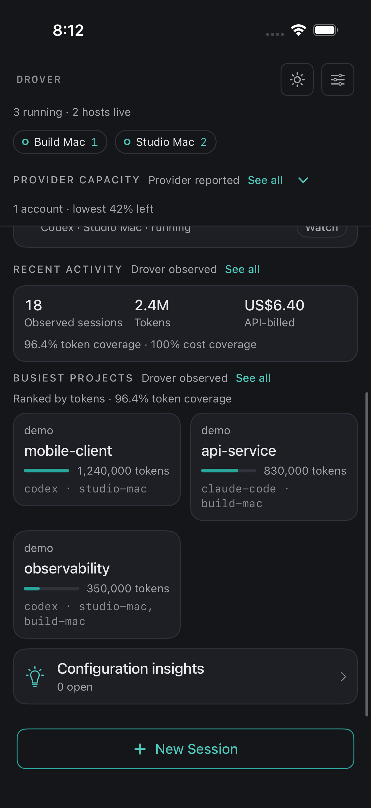
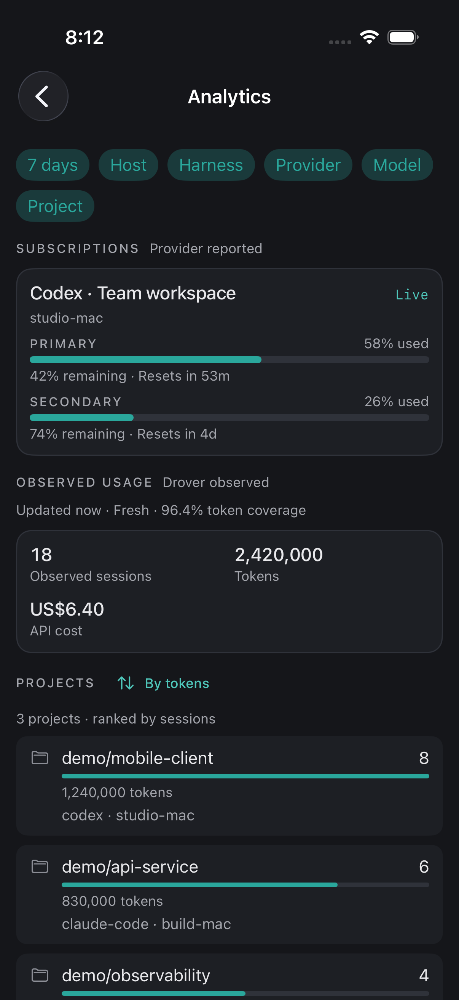

# Drover

<p align="center">
  
</p>

> Drive your coding-agent fleet from your pocket.

## What Drover is

Drover is a local-first cockpit and context store for a personal fleet of CLI
coding agents. It runs sessions on Claude Code, Codex, Antigravity (agy),
DeepSeek Harness, and compatible harnesses on machines you control, and ingests
activity from others, including OpenClaw and Hermes, as context. A native iOS
client lets you inspect sessions, answer prompts, send turns, hand work off,
and attach to a terminal.

Drover is self-hosted software for one trusted operator. The supported v0.3
network boundary is localhost, a private LAN, or a private Tailscale network.
It does not require a Drover cloud service.

## Screenshots

<p align="center">
  
  
  
  
</p>

The dark-mode fleet view groups live work by host and keeps provider capacity
within reach. The launch sheet selects a host and harness, checks
authentication, and carries model and reasoning preferences into a new
session. The cockpit summarizes observed activity and projects, while
Analytics expands provider-reported quota windows and usage distributions.

## How it works


- The **command plane** connects the iOS app to `drover-server` and per-host
  `drover-harnessd` daemons for session control, structured chat, approvals,
  handoff, and terminal streaming.
- The **context plane** collects durable agent events and spans into local
  Parquet and DuckDB storage, then derives summaries, project briefs, and
  embeddings for recall.
- The **MCP surface** exposes that context to coding agents as `drover_*` tools.
- An optional **session archive** enriches recall across harnesses. Point
  Drover at a local [Pond](https://github.com/tenequm/pond) HTTP endpoint and
  the `drover_recall_bundle` MCP tool composes bounded, source-cited evidence
  from archived native sessions alongside Drover's own context. Off by
  default; Drover works fully without it, and an archive outage only removes
  the enrichment.

See [Architecture](docs/architecture.md) for the component boundaries and
[Context Store](docs/context-store.md) for the data model.

## Quickstart

Requires macOS or Linux with Python 3.11+.

```bash
curl -fsSL https://raw.githubusercontent.com/arniesaha/drover/main/install.sh | bash
```

This installs a checksum-verified release, starts the server and a local
harness host, detects an address your phone can reach, and prints a QR code.
Scan it with the app and you are connected: no token is typed or copied.

It also links `drover-server` into `~/.local/bin`, so it is on your PATH. When
that directory is not on your PATH, the installer says so and prints the line
to add.

Add another machine with the one-liner printed by
`drover-server pair-host --name <host>`.

## Optional: cross-session recall archive

Drover can read a local [Pond](https://github.com/tenequm/pond) archive
(pinned: v0.16.3) to answer "how did we solve this?" questions across every
harness's native history. The integration is read-only, loopback-only, and
disabled by default -- enabling it changes nothing about session control,
telemetry, or handoff.

```toml
# ~/.drover/config.toml
[archive]
enabled = true
base_url = "http://127.0.0.1:9797"
```

Set up the archive itself with Pond (one-off, then re-run `pond sync` when
you want fresh history):

```bash
pond init --yes --skip-mcp --adapters claude-code,codex-cli
pond sync
pond serve --transport http
```

Properties worth knowing:

- `base_url` must resolve to loopback; redirects are never followed.
- Responses are streamed and byte-capped before they are decoded, and one
  recall bundle is composed at a time, so the enrichment cannot become a
  memory problem for the hub.
- When Pond is down or the feature is disabled, `drover_recall_bundle`
  returns Drover-only context with a structured warning -- never an error,
  and never a blocked startup.
- The archive covers the machine it synced. Fleet-wide coverage is a
  planned phase (shared object-store destination), not a property of this
  release.

### Check local archive inventory coverage

This operator-run check compares current native history, Drover's registry,
and an existing local Pond store. Run the inventory commands before coverage:

```bash
drover-server archive source-inventory \
  --host-id HOST_ALIAS --output PRIVATE_NATIVE.json
drover-server archive pond-inventory \
  --pond-binary /absolute/path/to/pond \
  --storage-path /absolute/path/to/local/pond --output PRIVATE_POND.json
drover-server archive coverage \
  --source-inventory PRIVATE_NATIVE.json \
  --pond-inventory PRIVATE_POND.json \
  --output PRIVATE_COVERAGE.json
```

If a current Claude source contains only `ai-title` and `agent-name` metadata,
Pond intentionally has no session to archive. Assess that one canonical file
explicitly, then pass its receipt to coverage:

```bash
drover-server archive source-eligibility \
  --host-id HOST_ALIAS --source /absolute/path/to/source.jsonl \
  --output PRIVATE_ELIGIBILITY.json
drover-server archive coverage \
  --source-inventory PRIVATE_NATIVE.json \
  --pond-inventory PRIVATE_POND.json \
  --source-eligibility-receipt PRIVATE_ELIGIBILITY.json \
  --output PRIVATE_COVERAGE.json
```

The eligibility assessment refuses files larger than 4 KiB, incomplete or
noncanonical files, symlinks, unknown event types, and any message-bearing
content. Its receipt stores no source path or event content and is bound to the
schema-v2 source inventory's opaque fingerprint, so a changed source invalidates
the receipt.

These output files contain private session identities or fingerprints. Keep them local and
owner-only: Drover creates them as new `0600` files, refuses an existing
output, and accepts identity-bearing inputs only when they are private regular
files. Only the aggregate JSON printed to stdout may be copied into a
sanitized operations record.

The coverage command reports an applied receipt as
`source_not_archive_eligible`. It exits `2` after writing its private report when a
conservative readiness check is not clean; this is a blocked readiness result,
not permission to change the archive. Its three candidate miss reasons are:

- `discovered_not_synced`: the current native source exists but no matching
  Pond session was found.
- `source_absent_after_prior_inventory`: the source is absent now but was
  present in a supplied prior inventory.
- `unverifiable`: neither current nor prior native inventory can verify the
  unmatched registry candidate.

Duplicate source identities, cross-harness native-ID collisions, duplicate
logical Pond signatures, and Pond sessions too empty to compare are all
reported conservatively and can block readiness. They are candidates for
investigation, not deletion decisions. Candidate identity matches are not
content certification: `certified_coverage.status = "not_implemented"`.

These commands do not sync or upload data, configure Cloudflare R2 or other
remote storage, certify archive content, write to the Pond archive, or
authorize retention or deletion.

For the manual experimental backup boundary, see
[Verified Pond backups to R2](docs/archive-r2-backup.md). The local Pond store
remains the only live recall and sync target; R2 stores immutable backup
generations for restore into a fresh stopped local directory and is never a
live recall or sync target.

Run the installer as `install.sh --dry-run` to preview its actions without
changing anything.

Continue with [Getting Started](docs/getting-started.md) for the source-build
path, verification, private Tailscale setup, and optional context ingestion.

## Context store

Raw agent events and OpenTelemetry spans are durable facts. Drover stores them
as partitioned Parquet, exposes normalized DuckDB views, and keeps mutable
derived context such as summaries, briefs, embeddings, and job provenance in
DuckDB. Derived records always retain links back to source sessions or spans.

The model and its compatibility boundary are documented in
[Context Store](docs/context-store.md). Historical telemetry may retain
`nexus.*` attributes; new public APIs, commands, and MCP tools use Drover.

## Supported networking and security

- Supported: localhost, a trusted private LAN, and a private Tailscale network.
- Not supported for v0.3: Tailscale Funnel or any public-internet exposure.
- Authentication: individually issued device and host bearer credentials; the
  legacy shared token remains available for upgrades until explicitly disabled.
- Not provided: multi-user isolation, RBAC, SSO, host-bound credential
  enforcement, or a hosted control plane.

Read [Security](docs/security.md) before exposing a listener beyond localhost,
and [Multi-Host](docs/multi-host.md) before adding another machine.

## Build the iOS app

The iOS app ships from source. It requires Xcode 16+, iOS 18+, and XcodeGen.

```bash
brew install xcodegen
cd apps/drover
xcodegen generate
open Drover.xcodeproj
```

Select your Apple development team and run the `Drover` scheme on a simulator
or connected iPhone. See the [iOS build guide](apps/drover/README.md) for tests,
device signing, and server configuration.

## Documentation

- [Getting Started](docs/getting-started.md)
- [Architecture](docs/architecture.md)
- [Context Store](docs/context-store.md)
- [Integrations](docs/integrations.md)
- [Multi-Host](docs/multi-host.md)
- [Security](docs/security.md)
- [GitHub Actions Runner](docs/github-actions-runner.md)
- [Agent Skills](skills/README.md)

## Status and limitations

Drover v0.3 is source-distributed software for technical users operating a
trusted personal fleet. The Python server and native iOS client are functional,
but packaging, host-bound credential enforcement, timely background push
notifications, and broader context interchange standards remain future work.

See [open issues](https://github.com/arniesaha/drover/issues) for current bugs
and accepted user-visible work.

## License

Apache-2.0. See [LICENSE](LICENSE).
