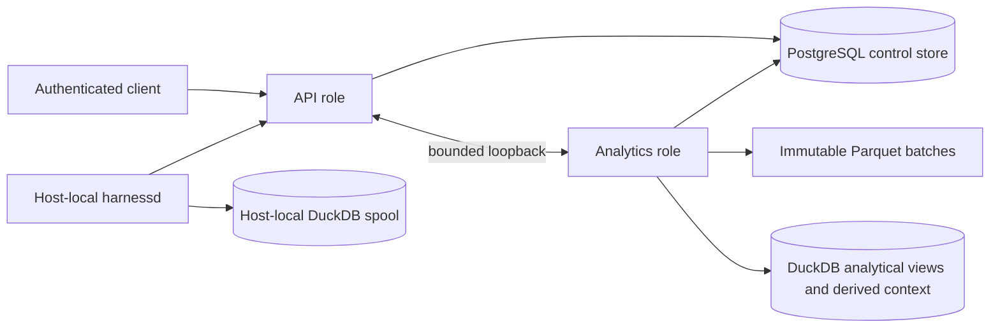

# Architecture

Drover has a command plane and a context plane. A fresh central installation
uses PostgreSQL for control state and keeps analytical state local. Existing
DuckDB control configurations remain supported until an explicit migration.
PostgreSQL can separate central API serving from analytical work without
changing the host-local harness daemon.

## Command Plane

The command plane carries live fleet operations:

1. The iOS app or another authenticated client calls `drover-server` over the
   `/harness` HTTP and WebSocket API.
2. `drover-server` maintains the fleet registry and routes each operation to a
   host connection.
3. A per-host `drover-harnessd` owns local agent processes, structured
   protocol adapters, PTY/tmux sessions, and terminal I/O.
4. Direct hosts accept private inbound connections. Relay hosts dial out to the
   central server over the same trusted LAN or tailnet.

The central server does not execute remote commands itself. The host daemon is
the authority for processes and filesystem access on its machine.

Drive-capable harnesses are converging on a registered adapter contract and a
versioned capability matrix consumed by web and iOS. Collection remains a
separate context-plane boundary: observing a harness does not make it a launch
target. See [Harness Adapter Architecture](harness-adapter-architecture.md) and
[ADR 0001](adr/0001-harness-adapter-capability-registry.md).

## Context Plane

The context plane turns local agent activity into durable, queryable memory:

1. `drover-collect` and hooks emit agent events. Spans arrive only when an
   external OTLP producer is configured.
2. Ingest normalizes identifiers, attributes repository context, deduplicates
   records, and writes partitioned Parquet facts.
3. DuckDB views expose normalized events, spans, sessions, links, pull-request
   events, and routing records without duplicating the fact store.
4. Workers create summaries, project briefs, decisions, and embeddings in
   mutable DuckDB tables.
5. MCP tools query raw and derived context for recall and handoff.

See [Context Store](context-store.md) for table ownership, identity, and
provenance rules.

## PostgreSQL Serving Store

Fresh `drover-server init` configuration sets `[control_store] backend =
"postgres"`. The central serving store owns fleet hosts and sessions, harness event metadata and
payload projections, live recap state, central credentials, server identity,
and content-consent state. It does not replace the analytical lake.

The reference hub migrated its own control store from DuckDB to PostgreSQL on
2026-09-21 using the offline import, and runs the combined role. Its analytical
lake and every host-local harness spool remain DuckDB. Once a control store has
accepted PostgreSQL writes, recovery is forward-only: it needs the PostgreSQL
state together with the immutable archive files its published manifest
references. A pre-migration DuckDB file is an audit record of earlier history,
not a rollback target.

An existing config that omits `[control_store]` retains its DuckDB control
store. `drover-server init --control-store duckdb` creates an explicit fresh
legacy configuration. Neither path creates or migrates a control store without
the corresponding operator command.

The analytics role exports pending central harness events into immutable Parquet
batches, records them in a PostgreSQL manifest, then acknowledges them. DuckDB
remains the home for analytical views, derived context, MCP and OTLP work, and
the local-first default. A central API role reads PostgreSQL and has no direct lake fallback;
it uses a bounded authenticated loopback boundary for analytical routes and
cold archived payload reads.

## Process Boundaries

| Component | Runs on | Owns |
| --- | --- | --- |
| iOS app | iPhone or simulator | Presentation, local settings, token in Keychain |
| `drover-server` API role | Central machine | Fleet API, pairing, relay, push, PostgreSQL control readiness |
| `drover-server` analytics role | Central machine | Ingest, immutable export, archive resolution, derived workers, MCP, OTLP |
| `drover-server` all role | Central machine | Combined API and analytics startup, with the configured control backend |
| `drover-harnessd` | Every harness host | Agent processes, adapters, PTY, terminal stream |
| `drover-collect` | Source hosts | Local log parsing and source-side attribution |
| PostgreSQL control store | Default fresh central storage | Fleet serving state, credentials, consent, durable export manifest |
| DuckDB + Parquet | Local or analytics storage | Durable analytical facts, views, derived context, ledger |
| Redis Streams | Optional central dependency | Retry coordination only |

## Interfaces

- Harness API: authenticated HTTP and WebSocket, normally port `7080`
- Host daemon: private HTTP and WebSocket, normally port `7081`
- MCP: streamable HTTP at `/mcp`, normally port `7077`
- OTLP: gRPC ingest, normally port `4317`
- Files: JSONL inputs under `~/.drover/incoming/`
- API and analytics boundary: loopback-only HTTP, normally API port `7080` and
  worker port `7082`

All central listeners bind to localhost by default. Ports and bind addresses
are configurable for deliberate private-LAN or private-Tailscale deployments.
Public-internet exposure is not supported for v0.3.

## Failure And Recovery

- Ingest uses stable deduplication keys, so replaying a source batch is safe.
- Parquet facts survive a DuckDB catalog rebuild; views are recreated during
  bootstrap.
- Pipeline receipts fence duplicate work, attempts remain append-only, and
  artifacts record supersession explicitly.
- Optional workers can remain unavailable without stopping the command plane or
  durable ingest.
- With PostgreSQL split roles, a worker outage is reported separately from API
  readiness. Fleet and session requests remain central-store reads; analytical
  requests return an explicit unavailable result until the worker recovers.
- A pruned central payload requires its verified immutable archive. PostgreSQL
  state alone cannot reconstruct cold history after retention.
- Redis coordination can be disabled or rebuilt from durable DuckDB intent.

## PostgreSQL data flow

The worker reads only manifest-published batches. Generic Parquet compaction
does not own those immutable files. See [PostgreSQL control store](postgresql-control-store.md)
for configuration, offline cutover, retention, and recovery operations.

## Compatibility

Public processes, commands, APIs, and MCP tools use Drover naming. Historical
Parquet spans and stored integration values may retain `nexus.*` identifiers.
Readers preserve those values as compatibility inputs; new producers should
emit Drover naming. Compatibility storage is not a second public product name.

## Security Boundary

All components belong to one trusted operator. Device and host credentials
protect the central API, while the legacy shared bearer token remains enabled
by default for upgrades. Drover v0.3 does not provide host-bound credential
enforcement, RBAC, SSO, or multi-tenant isolation. See [Security](security.md).
