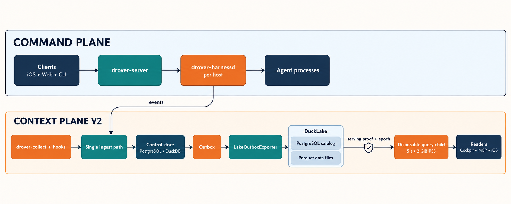

# Architecture

Drover has a command plane for live fleet operations and a context plane for
durable memory. Production switched to the V2 context architecture in v0.6.2
on 2026-10-06: PostgreSQL is the operational control store and DuckLake is the
analytical lake. DuckDB remains a supported compatibility control store and is
also used for host-local harness spools, but it is not the production analytical
serving backend.

## Command Plane

The command plane carries live fleet operations:

1. The iOS app or another authenticated client calls `drover-server` over the
   `/harness` HTTP and WebSocket API.
2. `drover-server` maintains the fleet registry and routes each operation to a
   host connection.
3. A per-host `drover-harnessd` owns local agent processes, structured protocol
   adapters, PTY/tmux sessions, and terminal I/O.
4. Direct hosts accept private inbound connections. Relay hosts dial out to the
   central server over the same trusted LAN or tailnet.

The central server does not execute remote commands itself. The host daemon is
the authority for processes and filesystem access on its machine.

Drive-capable harnesses resolve through a registered adapter contract. Hosts
and the central hub publish a bounded, versioned capability envelope (schema v1,
#418) in `/capabilities`, `/harness` and `/harness/hosts`; web and iOS controls
are moving onto it (#419, #420) and today still use the legacy `enabled` flag.
Collection remains a separate context-plane boundary: observing a harness does
not make it a launch target. See [Harness Adapter Architecture](harness-adapter-architecture.md)
and [ADR 0001](adr/0001-harness-adapter-capability-registry.md).

## Context Plane V2

V2 has one ingest path for central harness events. In the same control-store
transaction, ingest records the event metadata, split payload, bounded session
preview, and pending outbox intent. It does not write ingest Parquet directly.
Stable event identities and canonical `dedup_key` values make replay safe while
preserving source-native identity and raw payload provenance.

`drover-collect`, hooks, and harness delivery all enter this path. Optional OTLP
spans remain archival/diagnostic input; core memory and recall do not depend on
them. Pond is removed.

### Control store

PostgreSQL is the production authority for operational and mutable state:

- fleet hosts, sessions, credentials, consent, and live serving projections;
- event metadata, hot payloads, session previews, and durable outbox state;
- derived-memory jobs, attempts, summaries, briefs, embeddings, and task
  projection generations.

The compatibility control backend is DuckDB. It implements the same durable
outbox contract and retains inline envelopes, but selected DuckLake serving
requires PostgreSQL because reads bind lake facts to a bounded PostgreSQL
identity and serving-projection snapshot. Host-local `drover-harnessd` spools
remain DuckDB and are not the central analytical lake.

### DuckLake analytical lake and exporter

`LakeOutboxExporter` is the only runtime path from the control outbox into the
selected DuckLake catalog. One fenced owner claims bounded batches, freezes
their exact membership and hashes in PostgreSQL, and publishes each batch in an
isolated `export_worker` process. The DuckLake commit writes canonical events,
raw outbox rows, event versions, and an immutable export receipt as one catalog
snapshot. Only after the receipt is checked does the exporter acknowledge the
batch and its member events in PostgreSQL. A crash after the lake commit but
before acknowledgement resumes the frozen batch without creating a second
snapshot.

DuckLake has two inseparable storage parts:

- a PostgreSQL catalog containing DuckLake metadata and snapshot history; and
- Parquet data and delete files under the configured lake data root.

Reader, exporter, and admin catalog roles are separate. The exporter holds a
dedicated PostgreSQL advisory fence, and a catalog-side commit guard rejects
stale or unauthorized snapshot publication. Startup selects exactly one
exporter implementation; it does not provision or migrate the catalog.

### Serving, query children, proofs, and epochs

Canonical replay/search, files-touched, summarizer inputs, recall, cockpit and
project activity route through the selected backend. PostgreSQL remains
authoritative for identities and mutable memory projections. The API role does
not open the lake when roles are split; it uses the bounded authenticated
loopback analytics boundary. MCP and UI readers therefore receive either a
verified V2 result or an explicit unavailable response. There is no silent
fallback to legacy analytical history.

Every lake execution runs in a disposable OS query child. Admission is
serialized per lake, and the five-second deadline includes time waiting for
admission. Default release ceilings are 2 GiB monitored RSS, two DuckDB threads,
1,000 result rows, and 1 MiB of result data; individual callers may only tighten
them. The child receives the catalog credential by environment-variable name,
uses private spill space, permits one read-only statement, and is killed on a
deadline, memory, row, or byte-limit breach.

Offline `lake verify` creates `verification/serving-proof.json`. The proof binds
the absolute data root, catalog schema identity, verified snapshot, rebuild
report, and retained-table counts and hashes. Its SHA-256 is pinned in the
selected configuration. Every serving transaction checks that proof and the
current referenced-file set. Later snapshots are trusted only when their
`drover-export` commit metadata matches an immutable batch receipt; arbitrary
maintenance or provisioning invalidates serving authorization.

The configured analytics `epoch` names an explicit deployment selection. Read
models bind the epoch together with the proof hash, resolved lake root, and
PostgreSQL identity snapshot, then recheck that binding after the child returns.
A changed epoch, proof, root, identities, source heads, or catalog snapshot
fails closed instead of combining results from two selections. Writer
retirement is likewise latched to the complete verified selection and must be
explicitly renewed after a change.

## Process Boundaries

| Component | Runs on | Owns |
| --- | --- | --- |
| iOS, web, and CLI clients | Operator devices | Presentation and authenticated requests |
| `drover-server` API role | Central machine | Fleet API, pairing, relay, push, PostgreSQL control readiness |
| `drover-server` analytics role | Central machine | Ingest, lake exporter lifecycle, analytical routes, MCP, optional OTLP |
| `drover-server` all role | Central machine | Combined API and analytics startup |
| `drover-harnessd` | Every harness host | Agent processes, adapters, PTY, terminal stream, local DuckDB spool |
| `drover-collect` and hooks | Source hosts | Source parsing and attribution |
| PostgreSQL control store | Central storage | Operational state, hot payloads, outbox, derived-memory jobs/projections |
| DuckLake catalog + Parquet files | Analytical storage | Canonical event facts, versions, receipts, snapshot history |
| Disposable query child | Central machine | One bounded, verified analytical read |

## Interfaces

- Harness API: authenticated HTTP and WebSocket, normally port `7080`
- Host daemon: private HTTP and WebSocket, normally port `7081`
- MCP: streamable HTTP at `/mcp`, normally port `7077`
- OTLP (optional, off by default): gRPC ingest, normally port `4317`
- Collector input: JSONL under the configured incoming directory
- API and analytics boundary: authenticated loopback-only HTTP, normally API
  port `7080` and worker port `7082`

All central listeners bind to localhost by default. Ports and bind addresses
are configurable for deliberate private-LAN or private-Tailscale deployments.
Public-internet exposure is not supported.

## Failure and Recovery

- Event, payload, preview, and outbox intent commit atomically in the control
  store; ingest never depends on a simultaneous lake write.
- Frozen batches and immutable receipts make exporter recovery idempotent.
- Serving fails closed when the proof, receipt chain, catalog, identities, or
  referenced files do not match the selected configuration.
- A query-child timeout, memory breach, crash, or malformed reply cannot take
  the command-plane process with it.
- With split roles, an analytics outage leaves fleet and session control-store
  reads available while analytical routes report unavailable.
- Recovery and backup require the PostgreSQL control store together with the
  DuckLake catalog and every catalog-referenced data file; Parquet alone is not
  a complete lake backup.

See the [lake serving](operations/lake-serving.md),
[exporter](operations/lake-exporter.md), and
[cutover](operations/lake-cutover.md) runbooks for the detailed invariants.

## Compatibility

Existing configurations may still select the legacy analytical backend, and
DuckDB remains the compatibility control backend. Selection is always explicit;
files and environment variables do not auto-enable DuckLake. Historical facts
may retain `nexus.*` identifiers, which readers accept as compatibility inputs.

## Security Boundary

All components belong to one trusted operator. Device and host credentials
protect the central API, while the legacy shared bearer token remains enabled
by default for upgrades. Drover does not yet provide host-bound credential
enforcement, RBAC, SSO, or multi-tenant isolation. See [Security](security.md).
