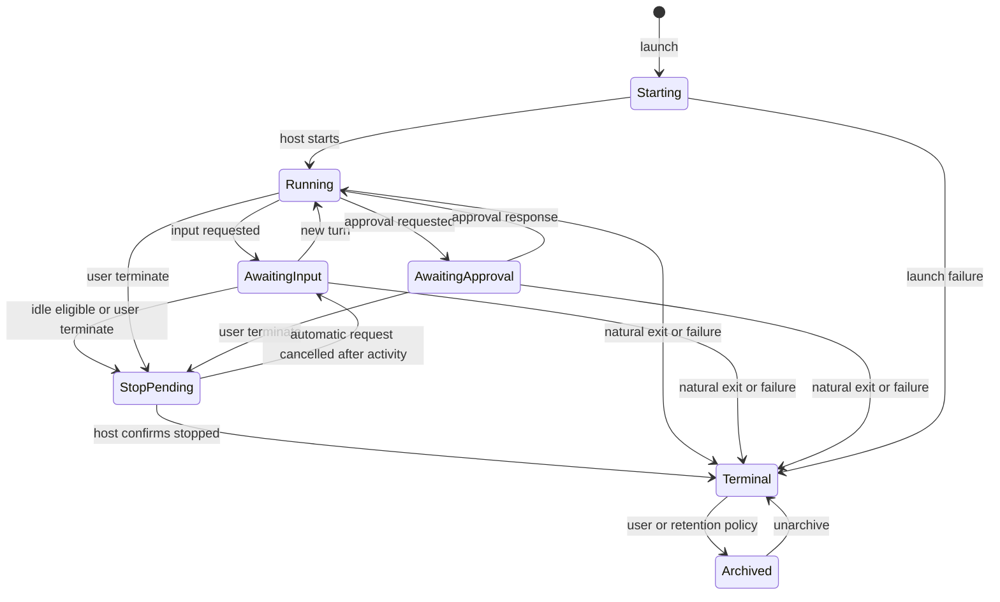

# Hub-side session lifecycle (#547)

Status: design for Arnab's review, 2026-10-06. No implementation authorized.
Code baseline: `5faf6a4f6c92aaa79614be836af7e5f135dee607`.
All paths and line references below refer to that baseline.

This proposal makes the hub responsible for lifecycle policy and durable intent,
while harnessd remains responsible for processes, Git inspection and filesystem
changes on its own host. Expiring a process, hiding a session and collecting a
worktree are separate actions. None proves that the session's work merged.

Sources: [issue #547 and cleanup comment](https://github.com/arniesaha/drover/issues/547)
and [issue #234](https://github.com/arniesaha/drover/issues/234).
The cleanup findings are observations reported in the issue, not a fresh host audit.
This document does not inspect the external client script or modify either host.

## 1. Current state, with code evidence

### Session creation and end

- The hub forwards create to the selected host and synchronizes a successful
  response into its registry. Creation has a 120-second budget
  (`src/drover/server/metrics.py:1648`, `src/drover/server/metrics.py:1670`,
  `src/drover/server/metrics.py:110`).
- Registry creation defaults to `created`, generates `harness-<uuid>` IDs,
  and deduplicates client IDs using a unique key and transaction
  (`src/drover/server/harness/registry.py:610`,
  `src/drover/server/harness/registry.py:638`,
  `src/drover/server/postgres_schema.py:39`).
- PTY launch writes `starting`, starts the process in the supplied cwd, then
  writes `running`; failure writes `errored` with `ended_at`
  (`src/drover/server/harness/daemon.py:2223`,
  `src/drover/server/harness/daemon.py:2246`,
  `src/drover/server/harness/daemon.py:2253`,
  `src/drover/server/harness/daemon.py:2264`).
- Structured launch uses adapter worktree capability or Factory isolation,
  records `starting`, and writes `running` before starting the driver
  (`src/drover/server/harness/daemon.py:2533`,
  `src/drover/server/harness/daemon.py:2585`,
  `src/drover/server/harness/daemon.py:2614`).
- Structured natural exit writes `completed` for exit code zero or `errored`
  otherwise, sets `ended_at`, appends `session.exited`, and invokes worktree
  cleanup (`src/drover/server/harness/daemon.py:3017`). PTY reconciliation
  finalizes exited processes as `completed`
  (`src/drover/server/harness/daemon.py:3662`).
- Structured terminate marks the ID before closing the driver, writes
  `terminated` and `ended_at`, appends an event, and invokes cleanup
  (`src/drover/server/harness/daemon.py:3311`). PTY terminate closes the PTY,
  signals the process, escalates to SIGKILL after its wait budget, and finalizes
  the row; its finalizer has no worktree cleanup call
  (`src/drover/server/harness/pty.py:168`,
  `src/drover/server/harness/pty.py:205`,
  `src/drover/server/harness/daemon.py:3298`,
  `src/drover/server/harness/daemon.py:3640`).
- On restart, orphaned live structured rows become `errored`; orphaned PTY rows
  become `completed`. Recovery can set a row back to `running`, clear
  `ended_at`, and set `awaiting=input`
  (`src/drover/server/harness/daemon.py:3692`,
  `src/drover/server/harness/daemon.py:3700`,
  `src/drover/server/harness/registry.py:993`).

The issue's statement that sessions run forever is too broad for this baseline.
Natural exit and restart reconciliation already end rows. The missing policy is
expiry of otherwise live, quiet sessions, plus collection of preserved work.

### Awaiting, timestamps and the existing archived notion

| Concept | Current storage and meaning | Evidence |
| --- | --- | --- |
| Process lifecycle | `harness_sessions.status`, free text | `src/drover/server/postgres_schema.py:28` |
| Attention | `awaiting`, separate from status; model also has `last_activity` | `src/drover/server/harness/models.py:76`, `src/drover/server/harness/models.py:100` |
| End time | Nullable `ended_at`; status update preserves old value unless supplied | `src/drover/server/harness/registry.py:957` |
| Terminal/archived group | `completed`, `terminated`, `errored`, `failed`, not a literal `archived` status | `src/drover/server/harness/registry.py:58` |
| Listing visibility | Terminal rows can be capped/paged; unknown statuses remain live | `src/drover/server/harness/registry.py:877`, `src/drover/server/harness/registry.py:936` |
| Hub fleet snapshot | Uses the selected control-store registry and archived limit | `src/drover/server/metrics.py:2451`, `src/drover/server/metrics.py:2470` |
| Display idle | Derived after 30 minutes; awaiting and terminal states take precedence | `src/drover/server/session_graph.py:24`, `src/drover/server/session_graph.py:47` |

The structured manager sets approval/input attention and clears it on response
or user input, then updates registry activity
(`src/drover/server/harness/structured/manager.py:219`,
`src/drover/server/harness/structured/manager.py:318`).
Status updates do not clear `awaiting`
(`src/drover/server/harness/registry.py:970`). Subsequent activity/ingest writes
clear it for the four terminal statuses using hardcoded SQL lists
(`src/drover/server/harness/registry.py:1041`,
`src/drover/server/harness/registry.py:1661`). Thus stale terminal attention
remains possible immediately after finalization, as #234 reports.

Issue #234's "archived" example is actually `completed + awaiting=approval`.
Its cited line numbers are historical. At this baseline, exit appending still
supplies no sequence, rebuild still filters `seq > 0`, and live pushing is wired
through manager messages rather than this finalizer
(`src/drover/server/harness/daemon.py:3027`,
`src/drover/server/harness/registry.py:1584`,
`src/drover/server/harness/daemon.py:2651`). Restart reconciliation has a separate
unsent-event path (`src/drover/server/harness/daemon.py:4051`).
Do not infer lifecycle solely from awaiting or make an unreviewed blanket clear
as a side effect of this feature. #234 reports a concurrent-session regression
that must be revisited explicitly during implementation. The current concurrent
fixture waits for `awaiting=input` even as its fake CLI exits, but does not
directly assert `completed + awaiting=input`
(`tests/test_structured_e2e.py:331`, `tests/test_structured_e2e.py:342`).
Preserve its concurrency coverage while reviewing the raw-field invariant.

Current readers differ: iOS checks `completed`/`terminated` and `errored` before
attention, but does not explicitly handle `failed`
(`apps/drover/DroverKit/Sources/DroverKit/Models.swift:492`). The session graph
handles all four terminal statuses first
(`src/drover/server/session_graph.py:28`,
`src/drover/server/session_graph.py:60`). MCP active sessions uses
`archived_limit=0` and excludes retired hosts
(`src/drover/server/mcp/tools.py:1275`). The harness web list recognizes
`created`, `starting`, `running` as running
(`src/drover/server/web/static/harness.html:672`). These readers need one
explicit projection contract, including archived visibility.

### Worktrees and host-specific implications

Creation reserves `drover/<session-id>` at the repository's current HEAD and
adds `<worktrees_dir>/<session-id>`. Non-repositories or repositories without
commits return no worktree; actual creation failures fail closed
(`src/drover/server/harness/worktree.py:122`,
`src/drover/server/harness/worktree.py:155`,
`src/drover/server/harness/daemon.py:2543`).
The default root is `~/.drover/worktrees`; configuration can override it
(`src/drover/server/harness/daemon.py:1352`,
`src/drover/server/harness/daemon.py:4301`).

The in-memory worktree map is lost on restart, and end cleanup pops its entry
(`src/drover/server/harness/daemon.py:1360`,
`src/drover/server/harness/daemon.py:3035`). The startup sweep snapshots existing
paths under an exclusive directory lock, then uses the same cleanup policy in
background (`src/drover/server/harness/daemon.py:4327`,
`src/drover/server/harness/daemon.py:4337`,
`src/drover/server/harness/daemon.py:4382`). Reconstruction skips detached HEADs
and non-`drover/` branches
(`src/drover/server/harness/worktree.py:225`).

Cleanup only removes a tree with empty status including ignored and untracked
files and HEAD equal to its base SHA. It then compare-deletes the untouched
branch. Any work or failed inspection is preserved
(`src/drover/server/harness/worktree.py:257`). It does not test PR merge state.
Also, the session row's `branch` comes from the request, while the generated
worktree branch is in the start event; these can differ
(`src/drover/server/harness/daemon.py:2592`,
`src/drover/server/harness/daemon.py:2631`).

| Host | What terminate means at this baseline |
| --- | --- |
| Studio | Structured terminate attempts the conservative cleanup above; only untouched worktrees disappear. A preserved tree is no longer in the live map. |
| NAS | The same code paths apply. The cleanup comment reports a remaining worktree after terminate; this is compatible with preservation or a missing map entry. The issue does not establish which occurred. |
| Either | PTY sessions do not acquire an automatic worktree in the PTY creation path; their finalizer does not collect manually supplied worktrees. |

These are code-path conclusions, not assertions about installed versions or
configuration on either machine. Evidence for the table is the creation,
termination and cleanup references above; there is no host-name conditional in
those functions.

### Offline terminate and external stopgap

The hub routes via live relay or direct HTTP, with a default 15-second budget;
a disconnected relay returns 502 and direct timeout returns 504
(`src/drover/server/metrics.py:2770`,
`src/drover/server/metrics.py:2802`,
`src/drover/server/metrics.py:2881`). Crucially, terminate tombstones the hub row
and returns success on **404 or 502**; 504 passes through
(`src/drover/server/metrics.py:1826`). Unreachability is not proof that a remote
process stopped. This differs from the issue's generalization of offline 504s.

According to #547, the external `~/clawd/scripts/drover.py reap` is a nightly
stopgap terminating sessions idle more than 12 hours. Its implementation and
skip behavior are not available in this repo and are not assumed here.
The issue reports 34 running rows, 27 quiet for days, 76 Studio worktrees and
31 GB before manual cleanup. Its comment reports 18 worktrees removed and five
sessions terminated, with dirty/untracked archives and branches kept.

## 2. Proposed state model and reader contract

Prefer the existing status, awaiting, activity and end fields. Add orthogonal
metadata only where one field cannot safely express process, visibility and
filesystem facts. Do not add literal `idle-expired`, `archived` or `gc'd` to
`status`: that would obscure outcome and expand every terminal allowlist.

| View/state | Proposed representation | Trigger/authority |
| --- | --- | --- |
| Created/starting | Existing status values | Authenticated launch, harnessd acknowledgement |
| Running | `status=running`, effective awaiting null | harnessd process/events |
| Awaiting input/approval | `status=running`, effective awaiting input/approval | harnessd attention events |
| Idle candidate | Derived input-wait age, not persisted lifecycle | Hub policy scan |
| Stop pending | Nonterminal status plus pending terminate operation | User or hub expiry policy |
| Idle-expired | `status=terminated`, `end_reason=idle_expired` | harnessd confirms stop for policy operation |
| Terminated | `status=terminated`, reason user/operator | harnessd confirms stop |
| Completed/error | Existing terminal statuses | harnessd exit/reconciliation |
| Archived | Terminal row plus `archived_at` | User, or hub after terminal retention grace |
| GC pending/retained/collected | Worktree record and operation receipt | Hub schedules; owning harnessd executes |

`ended_at` records observed process end, never request time. Legacy uncertain
ends remain explicitly marked `end_reason=legacy_unconfirmed` until reconciled.
`archived_at` means hidden from active/recent cockpit presentation; it does not
mean worktree backup exists. `gc_state=collected` means the directory was removed;
never delete session history or summaries as part of filesystem GC.
An archive backup receipt uses a separate worktree record.

GC is an independent progression on terminal worktree records, so it is omitted
from this process/visibility diagram. Resume is a new linked session by default;
if existing recovery revives the same ID, increment its lifecycle generation and
cancel old operations before allowing launch.

| Projection | Cockpit/web | iOS | MCP |
| --- | --- | --- | --- |
| Running/awaiting | Active card, appropriate attention | Same status and attention | Active with effective awaiting |
| Display idle | Quiet badge; no automatic approval expiry | Quiet badge | Derived age/reason |
| Stop pending/offline | Visible, stop queued badge | Same; no done badge yet | Active, operation ID and host liveness |
| Terminal/idle-expired | Recent history with end reason | Done/error and expiry reason | Excluded from active; detail/history reachable |
| Archived | Hidden by default; explicit history filter | Same history filter | Explicit include-archived/detail lookup |
| Collected worktree | History shows receipt and restore availability | Same details | GC state, archive locator and evidence |

All three projections must check terminal status first and expose effective
awaiting null for terminal rows, even if historical raw awaiting remains stale.
Old clients keep existing statuses; extra fields are additive. Updated list
filters must implement `archived_at` hiding without treating unknown statuses as
terminal. API compatibility tests must cover explicit archived/detail retrieval.

## 3. Idle expiry and protection

Run a bounded hub worker against PostgreSQL control state. Use a leader lease
and row claims so multiple hub processes cannot schedule duplicates. harnessd
checks fresh local state immediately before stopping; it does not independently
choose expiry. Offline hosts retain durable intent without invented end times.

Proposed knobs (names pending implementation review):

| Setting | Default | Meaning |
| --- | --- | --- |
| `lifecycle.mode` | `report` | `off`, `report`, `enforce`; report has no destructive action |
| `lifecycle.idle_after` | `12h` | Input-wait age required for expiry |
| `lifecycle.scan_interval` | `5m` | Bounded, jittered scan |
| `lifecycle.archive_after` | `7d` | Terminal visibility grace; enforce only |
| `lifecycle.pr_freshness` | `15m` | Max age of PR evidence used for automatic action |
| `lifecycle.gc.mode` | `report` | Independent collection flag |
| `lifecycle.gc.grace` | `24h` | Minimum time after confirmed end |
| `lifecycle.gc.concurrency_per_host` | `1` | Filesystem operations serialized |

Eligibility requires confirmed `running`, `ended_at IS NULL`, effective
`awaiting=input`, and a known last meaningful activity older than 12h.
Require a fresh host check before execution. Unknown timestamp, future timestamp,
unknown status, collector, PTY without reliable attention, active tool/turn,
awaiting approval, and unverified local liveness all produce report/skip.
Do not reuse the 30-minute display-idle threshold as expiry policy.
Heartbeats and unchanged attention polling are not meaningful session activity.
During rollout, instrument activity provenance; do not expire old recovered rows
with missing activity using `updated_at` as an apparently reliable substitute.

Protection, rechecked at scheduling and execution:

- Any verified linked open PR, or discovered open PR for actual branch/HEAD,
  blocks automatic expiry and automatic GC. Discovery supplements linkage.
- Any live registered watcher or owner blocks both. Reuse a linked Factory
  owner lease where present; add expiring session watcher leases for other
  callers. Merely opening a websocket is not registration.
- `retention_policy=keep` blocks both without a TTL. Set through authenticated
  API/UI with actor and reason; essential for unmerged design-only work.
- PR lookup failure, stale evidence, missing watcher/owner lookup, or ambiguous
  identity blocks automatic action. Display the reason instead of guessing.

The existing Factory run already links a session to an owner and lease
(`src/drover/server/continuity_schema.py:7`); reuse that relationship instead of
copying owners into another authoritative table. Parent session identity is not
ownership (`src/drover/server/harness/models.py:102`).
An explicit user terminate may override expiry protections after displaying them;
it still cannot override archive safety for GC. Releasing keep does not itself
prove merge or authorize deletion.

## 4. Session to pushed branch / PR linkage

This is the central decision. The cleanup found session branches with no PR,
while their work was squash-merged under other fix/release branch names.
No-PR, idle, and lack of ancestry cannot distinguish stale work from the unmerged
portable-profile design commit described in the same comment.

| Approach | Benefits | Limits |
| --- | --- | --- |
| Capture at push time | Precise local HEAD and destination; immediate branch link | Arbitrary shell/other host pushes bypass capture; push does not identify a PR yet |
| Orchestrator reports via hub API | Handles renamed branches, cherry-picks, combined PRs and release branches | Requires adoption; mistaken provenance must remain auditable |
| Content check against main | Helps legacy trees where PR linkage is missing | Rebase, squash, edits, partial incorporation and binaries make completeness hard to prove |
| Discover PR using session branch | Cheap hint | Fails the observed renamed-branch case; insufficient as sole evidence |

Recommendation: explicit report API as the contract, push capture as a producer,
GitHub refresh as the verifier, content checks advisory in the first rollout.
Keep a many-to-many ledger: one session can feed several PRs; one PR can include
several sessions. Preserve each report and supersession rather than overwriting
`harness_sessions.branch` with a pushed branch.

A proposed idempotent `POST /harness/sessions/{id}/publications` records:

- Repository identity, remote identity, pushed branch, pushed SHA, session HEAD
  at report time, and base SHA for the contributed range.
- Optional PR repository and number; branch-only reports await PR resolution.
- Scope of contribution: all work through captured HEAD or explicit ranges;
  transformed/cherry-picked work carries a provenance assertion, not ancestry.
- Reporter identity, source (`orchestrator`, `push_capture`, `operator`), timestamp,
  idempotency key, and evidence version. No tokens or authenticated remote URLs.

After a successful push, the orchestrator submits the destination and captured
source head. After PR creation it submits the number using the same publication
identity. A local producer should durably retry a lost report; the hub must not
interpret missing linkage as completion. Auth scope limits reports to sessions
and repositories that the reporter controls. GitHub state is fetched with the
hub's configured integration, never accepted as authoritative from the reporter.

The hub stores verified PR head/base, merged flag/time and merge commit SHA,
closed state and observation timestamp. Closed-unmerged is **abandoned**, not
merged: require archive plus explicit archive authorization before collection.
This deliberately tightens #547's proposed "PR is closed" deletion shortcut.
Merged is a completion signal only for the reported contribution snapshot.
New local commits or dirty files after that snapshot remain unaccounted work.
If several contributions cover a session, every contribution must be resolved;
partial PR merge does not mark the whole session done.

Example fixture: session branch `drover/harness-example` at A, orchestrator
cherry-picks its changes to `fix/example` at B, PR squash merges to main at C.
Neither A nor B is an ancestor of C. A verified report linking A's contribution
to the merged PR lets the hub recognize incorporated work through A. A later
session commit D is still unmerged and protected. A branch-only lookup must
never classify A as disposable merely because no PR is found.

For existing sessions, offer operator linkage with captured HEAD, or explicit
archive-and-collect. Content comparison may show a proposed match using pinned
main SHA, binary-aware tree/diff comparison and diagnostics; it grants no
automatic deletion authority initially. Patch IDs alone cannot prove all work
was incorporated. A report that claims transformed coverage requires a trusted
reporter and remains an explicit assertion surfaced in the collection plan.

## 5. Worktree ownership, archive and collection

Hub ownership is restricted to canonical `~/.drover/worktrees/*` on each host,
plus a matching durable session/worktree record. A path prefix alone is not
ownership. Check canonical root, host ID, Git common directory and worktree
identity; reject symlink escapes, the main checkout, locked trees and live
processes. Configured alternative roots are report-only under this proposal.
This is stricter than the existing configurable root and needs Arnab's decision.

Inventory via each host's harnessd and `git worktree list --porcelain`. Report
foreign trees, including temporary, developer, subagent and release trees from
the issue; never remove them. Legacy owned-root entries need verified adoption
of the original session, or operator approval, before destructive collection.
Persist actual path, branch, base SHA and repository identity at creation so
restart does not depend on branch reconstruction. Detached owned trees remain
eligible for safe archiving after ownership is established.

Eligibility after grace and fresh protection checks:

| Local work | Proposed action |
| --- | --- |
| Untouched, clean, original HEAD | Collect under ownership/live-session checks |
| All captured contributions verified merged, clean | Collect; retain branch/ref and manifest |
| Unmerged commits, unknown coverage or closed-unmerged PR | Retain by default; explicit archive-and-collect only |
| Dirty, untracked or ignored files | Retain by default; archive-and-collect requires complete verified backup |
| Foreign, live, ambiguous identity, inspection failure | Report only |

No unmerged commit or uncommitted/untracked file may be deleted without an
archive. Archive every nontrivial collected tree even when PR evidence says
merged; this also protects mistakes in transformed contribution assertions.
An explicit `archive` retention choice authorizes backup and later collection,
but never skips the backup. Visibility archiving is a different action.

Per-host execution protocol:

1. Claim operation and acquire repository/worktree exclusion with launch,
   resume, startup sweep and other GC. Verify no process uses the tree.
2. Resolve path and repository identity; inspect HEAD, base, refs, submodules,
   index, tracked diff, untracked and ignored files. Pin evidence fingerprint.
3. In report mode, emit exact keep/collect reason, backup size estimate and
   intended commands. Do not write refs, archives, remove or prune.
4. For enforce, stage an archive outside the worktree being removed. Include
   `git diff HEAD --binary`, a staged diff/index description, untracked tgz,
   and ignored-file backup. Include submodule state/content or refuse collection.
5. Write manifest: session/host/operation IDs, path, repository, branch or
   detached marker, base, HEAD, refs, pinned main, contribution/PR evidence,
   status/file list, permissions, checksums, format version, capture time.
6. Preserve HEAD under `refs/drover-archive/<session>/<operation>` for detached
   HEADs and for heads not safely anchored by a retained branch. Preserve all
   needed commit objects; verify reachability. Retain session branches by default.
7. Store a Git bundle with archive refs for nontrivial backups so loss of the
   local repository cannot destroy the only archived commits. Verify bundle and
   unpackability/checksums of tar and diff; fsync then atomically finalize receipt.
8. Reinspect fingerprint before removal. Any concurrent change cancels the
   operation and retries from inspection with a new archive; no stale plan removal.
9. Remove via Git worktree commands, using force only after verified complete
   archive when required; prune only stale registrations under repository lock.
10. Persist host receipt and report it to the hub. Mark collected only after
    verified absence; keep receipt, archive location and restore instructions.

Archive errors, full disk, permission errors, unrepresentable filenames or
non-quiescent external writers fail closed. NUL-safe enumeration and archives
must handle symlinks and filenames with whitespace without escaping the root.
External writers cannot be fully fenced by the hub; refuse automatic dirty-tree
collection if quiescence cannot be established. Do not omit ignored files as
"reproducible" without explicit operator review.
Archive storage is local per host with durable receipt; recommend replication
before removing unmerged work. If replication is unavailable, retain that tree.
No automatic archive/ref retention expiry in this phase. Restore should recreate
a worktree from bundle/ref, apply tracked changes, then extract untracked/ignored
files into a reviewed destination. A backup is not verified until restore checks
have succeeded in the integration fixture.

Termination hands the worktree to this inventory/GC workflow, even when it
cannot remove it. During enforce rollout, bring the existing end cleanup and
startup sweep under the same ownership and operation exclusion rules; do not run
two independent deletion policies. Report mode leaves their baseline behavior
unchanged and reports separately that untouched trees may still be removed by
those existing paths.

## 6. Offline hosts and reconciliation

Persist stop/GC intent in the control transaction before dispatch. Return 202
with operation ID for pending work, including offline hosts. Do not tombstone on
transport 502 or set `ended_at` while the host may still run. Unknown session
404 requires an inventory/reconciliation result, not blind success.

Each operation has session generation, host identity, action, reason, requester,
preconditions, idempotency key, attempt count, lease and durable outcome.
Host receipts use operation ID and a local durable journal to survive restart.
Retries are at least once; host execution and receipt replay must be idempotent.
A response lost after removal is reconciled from the journal and fresh inventory.
A missing directory without a receipt is recorded as missing/unknown backup,
not invented as safely archived.

On heartbeat/reconnect, negotiate lifecycle capability, replay host receipts and
inventory first, then claim pending commands. Never forward a queued operation
to a different host or revived session generation. GC waits for confirmed stop,
fresh PR state, fresh filesystem inspection and all protection checks.
Automatic idle stop is cancelled if new activity, keep, watcher or open PR makes
it ineligible; explicit user stop survives new activity unless cancelled by the
user. Recheck generation/turn lock locally before closing the process.

Back off with jitter, expose queue age and last error, and keep offline work
pending without an expiry that discards intent. Retired/replaced host operations
require explicit reassignment review. No direct fallback for disconnected relay
hosts. Legacy tombstoned rows require host reconciliation before GC; their
terminal status is not evidence of physical stop.

## 7. Schema, migration and rollout

Use PostgreSQL control tables for authoritative policy, operations and receipts.
The baseline central schema already stores harness state and ordered migrations
(`src/drover/server/postgres_schema.py:28`,
`src/drover/server/postgres_schema.py:636`). The latest ordinary migration is 12;
8 is reserved for conditional vector setup
(`src/drover/server/postgres_schema.py:541`,
`src/drover/server/postgres_schema.py:556`). Allocate 13 only if still unused at
implementation time, otherwise the next unused version. Never edit released
migration statements (`src/drover/server/postgres_schema.py:527`).

Proposed additive schema, subject to review:

| Table/fields | Purpose |
| --- | --- |
| `harness_sessions`: `end_reason`, `archived_at`, `retention_policy`, `retention_reason`, `lifecycle_generation` | Extend outcome/visibility; default auto, unarchived, generation 1 |
| `session_publications` and immutable report/evidence revisions | Many-to-many contribution snapshots and verified PR observations |
| `session_watchers`: session, actor, lease-until, reason | Non-Factory protection leases; indexed live lookups |
| `session_worktrees`: host/session, canonical path, repo, base, branch, observed HEAD, GC state | Durable ownership and inventory; not just cached request branch |
| `session_lifecycle_operations`: identity, action, generation, preconditions, state, retry/lease, result | Durable command queue and audit |
| `worktree_archive_receipts`: operation, manifest checksum, locator, verification/replication status | Backup and restore evidence |

Foreign keys, uniqueness on idempotency keys and host/path identity, and pending
operation/idle candidate indexes keep scans bounded. Audit actor/time for keep,
archive/unarchive and publication correction. Do not let host session updates
replace hub-owned policy metadata. Host receipts and local generation checks need
additive local persistence with capability negotiation; do not assume the central
migration updates every daemon's local store. Older hosts remain report-only.

Rollout order:

1. Ship additive schema, reader projection and inventory/reporting capability.
   No schema-only activation of expiry or GC. Legacy rows have no inferred PR link.
2. Run report mode for at least a week across NAS and Studio. Compare candidates
   with operator review, including foreign roots, missing ownership and stale data.
   Record skipped/eligible counts, bytes, archive failures and queue age.
3. Adopt orchestrator reports/push producers and watcher leases. Protect active
   design work with explicit keep. Reconcile legacy uncertain terminal rows.
4. Enable idle enforce for selected capable hosts; leave GC report-only. Confirm
   queued stops, activity races, reconnect and reader behavior.
5. Enable GC for untouched and verified merged clean trees. Enable explicit
   archive-and-collect only after archive restore and replication checks pass.
6. Disable external nightly reap after hub expiry covers every required host
   and protections are validated. Coordinate that change outside this repo;
   this design does not edit the external script. Keep it disabled as rollback
   tooling, not concurrently scheduled with hub enforce.

Rollback: set both policies to report/off and stop claiming new operations;
allow in-flight archive transactions to finish safely or cancel before removal.
Retain additive data, receipts, refs and archives. Do not resurrect stopped
processes or hide failed pending operations. Observe pending user commands
separately from automatic policy so disabling expiry does not silently cancel them.

## 8. Test plan for implementation

Unit tests:

- Eligibility boundaries: 12h, missing/future activity, unchanged heartbeats,
  approval, running tool, terminal stale awaiting, collectors and unknown statuses.
- Skip rules: linked/discovered open PR, stale/error lookup, live Factory owner,
  watcher renewal/expiry, indefinite keep and explicit overrides.
- Projection matrix for cockpit, iOS and MCP, including `failed`, pending offline,
  archived filters, direct history lookup and collected worktree details.
- Publication idempotence, authorization, multiple sessions/PRs, partial coverage,
  corrected reports, moved branch heads and closed-unmerged classification.
- Canonical ownership, symlink escapes, foreign roots, configured root report-only,
  detached refs, invalid identity and any Git probe failure.
- Operation generation fences, concurrent claims, automatic cancellation after
  activity, user cancellation, and receipt replay after lost responses.
- #234 regression: terminal raw awaiting, status-first projection, concurrent
  structured sessions, unsequenced exit and rebuild/restart ordering. Any change
  to raw clearing must explain and replace the historical expectation explicitly.

Integration tests with real temporary Git repos/worktrees and PostgreSQL:

- Create A on a session branch; copy/cherry-pick onto another branch B; squash
  merge a fake verified PR to main C. Assert no session-branch PR and no ancestry,
  missing linkage retains, explicit verified full-snapshot linkage allows clean
  collection, and later D prevents automatic collection. No real GitHub writes.
- Repeat with closed-unmerged, multiple PRs with one still open, transformed
  contribution assertion, wrong repo/PR, partial changes and binary files.
- Dirty staged/unstaged, untracked-only probes and ignored-only output survive
  archive restore byte-for-byte. Include permissions, symlinks, odd filenames,
  submodules and detached HEAD bundle restoration after original repo removal.
- Crash after archive/ref write, after directory removal and before hub receipt;
  recover without duplicate removal or claiming nonexistent backup success.
- Simulate disk-full, checksum mismatch, bundle failure, force-remove failure and
  concurrent commits/files. Verify no removal without complete valid archive.
- Two hub workers, daemon restart, launch versus startup sweep/GC, same-path reuse,
  user resume versus queued stop, direct offline 502/504 and relay reconnect.
- Migrate an existing version-12 store and a fresh store, rerun idempotently,
  reject mutation of released migrations, negotiate with an old daemon/client.
- Full report-mode run must produce plans but no new stop, archive ref, tar,
  worktree removal or prune attributable to lifecycle policy.

Acceptance: the renamed squash case is recognized only with adequate provenance;
unmerged design work is retained; foreign trees are never removed; archive restores
all local work; offline intent eventually reconciles without false done status.

## 9. Open decisions for Arnab

1. **Publication authority:** orchestrator API, push interception, or content
   matching as primary. Recommend authenticated orchestrator API with optional
   push producers; content matching advisory until separately validated.
2. **Lifecycle representation:** new status strings versus terminal status plus
   metadata. Recommend `end_reason`, `archived_at`, and independent worktree state;
   preserve existing process statuses and status-first attention projection.
3. **Expiry protections/default:** broad quiet-session expiry versus input-only
   12h with fail-closed PR/owner/watcher/keep checks. Recommend input-only 12h,
   initial report mode, no automatic approval or unknown-activity expiry.
4. **Collection of unfinished work:** treat closed PR/no PR as disposable, retain,
   or archive automatically. Recommend retain; explicit archive-and-collect for
   abandoned/unmerged/dirty work, verified backup and replication before removal.
5. **Ownership roots:** literal default root only versus configured roots too.
   Recommend only canonical `~/.drover/worktrees/*` initially; alternative roots
   and foreign worktrees stay report-only pending explicit adoption policy.
6. **Archive retention/storage:** local-only with TTL versus replicated indefinite
   retention. Recommend replicated verified archives for unmerged work, no automatic
   archive/ref expiry in this phase, retain branches by default.
7. **Visibility and retirement:** immediate hiding versus grace, and when to remove
   client reap. Recommend 7d terminal archive grace, explicit history access, and
   retire nightly reap after a week of validated hub coverage on both hosts.
