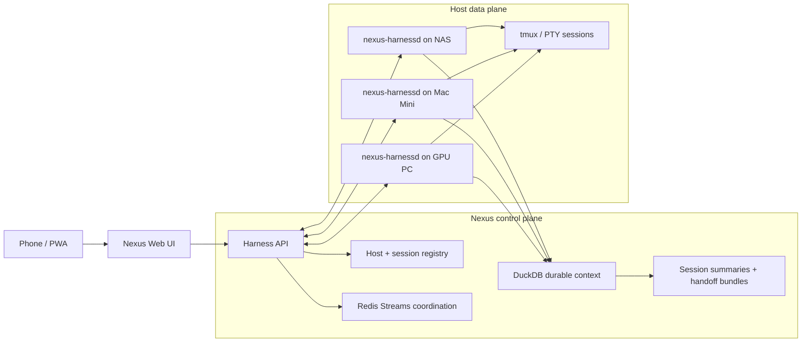

# Nexus Meta Harness MVP

Status: proposed scope
Date: 2026-06-21

## Goal

Add a first-party Nexus Meta Harness surface that lets Arnab control local
agent harness sessions from a phone while Nexus records the durable context
needed to summarize, search, and hand off that work later.

The MVP should answer one question:

> Can I open Nexus from my phone, see NAS / Mac Mini / GPU PC sessions, start or
> attach to Claude Code, Codex, Gemini, OpenClaw, or shell sessions, and have
> Nexus remember what happened?

This is intentionally the indie-developer version of a meta-harness. It is not
an enterprise policy plane, hosted sandbox, or team collaboration product.

## Inspiration And Planning Inputs

- [Omnigent](https://omnigent.ai/) and Databricks' "meta-harness" framing:
  common control surfaces across multiple agent harnesses.
- [obra/superpowers](https://github.com/obra/superpowers) planning pattern:
  explicit implementation plans, small tasks, clear verification.
- [addyosmani/agent-skills](https://github.com/addyosmani/agent-skills)
  lifecycle framing: define, plan, build, verify, review, ship.

The Nexus version should stay local-first and personal: control, remember, and
continue anywhere across the agent CLIs Arnab already uses.

## OSS Landscape Review

Reviewed comparables after the initial #192/#194 planning split:

- [nexi-lab/nexus](https://github.com/nexi-lab/nexus) / docs:
  positions Nexus as a filesystem/context plane and distributed VFS kernel for
  multi-agent systems. Its center of gravity is storage namespaces,
  permissions, inter-agent messaging, coordination, daemon-backed deployments,
  and eventually federation.
- [nexus-substrate/nexus-agents](https://github.com/nexus-substrate/nexus-agents):
  positions agents as the data plane and a higher-level control plane as the
  admission, review, audit, routing, and closed-loop tuning layer.
- Claude-control-style OSS projects:
  use `node-pty`, tmux, a browser client, and WebSocket terminal streaming to
  make a local CLI controllable from a phone or browser.
- Warp's universal CLI agent support:
  treats third-party agents as terminal-native tools and layers enhanced input,
  notifications, metadata, code review affordances, and remote control around
  supported CLIs.

Design implications for Arnab's Nexus:

- Do **not** compete with nexi-lab's Nexus on distributed VFS semantics, ReBAC,
  Raft, shared storage kernels, or general multi-tenant agent infrastructure.
- Do **not** compete with nexus-agents on autonomous governance, adversarial
  review, agent promotion/demotion, or broad orchestration policy.
- Do borrow the vocabulary: Nexus as context plane, harnesses as data-plane
  executors, and a thin local control plane for starting and attaching sessions.
- Do borrow the proven remote-control mechanism: PTY/tmux + WebSocket +
  phone-friendly UI.
- Do make the differentiator explicit: durable personal context and cross-harness
  handoff, not just a remote terminal.

The revised wedge is:

> A local-first mobile cockpit for personal CLI agent harnesses, backed by
> Nexus durable context and handoff memory.

This keeps Nexus complementary to the OSS landscape. It is smaller than a
distributed agent filesystem, more personal than an enterprise meta-harness, and
more context-aware than a generic web terminal.

## Product Boundary

Nexus remains the context plane:

- host and session metadata
- transcripts and summarized session memory
- artifacts, changed files, links, and handoff bundles
- project briefs and searchable derived context
- quality and readiness signals

The Meta Harness adds a control plane built on Nexus:

- register personal machines that can run harnesses
- start and attach to terminal-backed agent sessions
- stream live terminal output to the Nexus web UI
- send input, paste, interrupt, resize, and terminate sessions
- capture terminal transcript chunks into Nexus
- hand off a session summary to another harness

The hot terminal stream is not the durable record. It is live interaction data.
Nexus stores bounded transcript chunks, lifecycle events, summaries, and
artifacts as durable context.

## Target Hosts

| Host | Role | Network expectation |
| --- | --- | --- |
| NAS | Nix/OpenClaw, local repos, always-on Linux services | LAN and Tailscale/local IP |
| Mac Mini | Max, Nexus dogfood server, Xcode/macOS harnesses | LAN and Tailscale/local IP |
| GPU PC | Ollama/ComfyUI, CUDA workloads, optional local coding agents | Direct NAS link, LAN, and Tailscale/local IP |

Each host runs a small `nexus-harnessd` process. The daemon owns local PTY/tmux
sessions and reports health to Nexus.

## Host Agent Footprint

The host-side daemon is installed on every machine that should run local agent
CLIs: NAS, Mac Mini, and GPU PC. It should stay much closer to Mirador's
lightweight agent profile than to the full Nexus context runtime.

Deployment boundary:

- one central Nexus/Threadline server stores context, summaries, search, and UI
- one small `nexus-harnessd` process runs per host
- `nexus-harnessd` owns process control only: PTY, signals, resize, attach,
  detach, capability reporting, and bounded transcript forwarding
- embeddings, summarization, observability jobs, and durable context indexing
  stay in the central server/runtime

The Python daemon in the first MVP is for protocol validation and fast
iteration. It is acceptable while it remains within a rough idle budget of
under 100 MB RSS per host, but the protocol should remain clean enough that the
daemon can later be replaced by a Rust or Go binary without changing Nexus UI
or stored session semantics.

Longer-term target:

- `nexus-server` / future `threadline-server`: Python is acceptable because it
  is central and owns the heavier context plane
- `nexus-harnessd` / future `threadline-harnessd`: Rust or Go preferred for a
  tiny always-on data-plane agent
- target host-agent idle footprint: under 15 MB RSS, negligible idle CPU, and a
  single packageable binary
- macOS distribution: Homebrew tap plus launchd plist
- Linux distribution: `.deb` package plus systemd unit for NAS and GPU PC

Profiling is tracked separately before host-wide rollout in
[`harnessd-footprint.md`](harnessd-footprint.md). Measurements should separate
daemon overhead from child CLI overhead because Claude Code, Codex, Gemini, or
local model harnesses will usually dominate memory while running.

## MVP Harnesses

Launch presets for the first slice:

- `shell`
- `claude-code`
- `codex`
- `gemini`
- `openclaw`

Later presets:

- `hermes`
- `pimono`
- `opencode`
- repo-specific recipes
- custom command templates

For MVP, every harness is a terminal program. Smarter adapters can be added
later to detect approval prompts, structured tool calls, or native MCP/ACP/A2A
session metadata.

## Control Plane / Data Plane Split



### Control Plane

Nexus server owns:

- host registration and capabilities
- launch intent and authorization
- session lifecycle state
- desired terminal size and user input events
- heartbeats, leases, and stale-host detection
- transcript ingestion policy
- summary and handoff generation
- observability for hosts, sessions, queues, and errors

### Data Plane

`nexus-harnessd` owns:

- local process creation
- tmux/PTY attach/detach
- terminal stdout/stderr stream
- stdin writes and signals
- local repo/path validation
- command allowlist enforcement
- best-effort transcript batching
- health and capability reporting

## Redis Usage

Redis should coordinate session control. It should not carry the raw terminal
byte stream.

Use Redis Streams for:

- `harness.launch.requested`
- `harness.session.started`
- `harness.session.state_changed`
- `harness.session.input_requested`
- `harness.session.ended`
- `harness.host.heartbeat`
- retryable command delivery, leases, DLQ, and replay

Use WebSockets for:

- live terminal output
- user input
- terminal resize events
- ping/pong liveness for the current browser session

Use DuckDB/Parquet/local objects for:

- durable session metadata
- transcript chunks after redaction/truncation
- lifecycle event history
- artifacts, changed files, links, and generated summaries

Interview framing:

> Redis coordinates work and ownership. WebSockets carry the interactive hot
> path. Nexus stores durable truth.

## Network Modes

### Proxied Mode

The browser connects to `nexus.arnabsaha.com`. Nexus authenticates the user and
proxies WebSocket traffic to the correct `nexus-harnessd`.

Use this first unless latency is unacceptable. Terminal streams are much lighter
than Mirador video.

### Direct LAN / Tailscale Mode

The browser can connect directly to `http://<host-ip>:<harnessd-port>` when the
device is on LAN or Tailscale. Nexus still owns metadata and summaries.

This is a later optimization and should not block MVP.

## Web UI

Add subpages to the existing Nexus UI:

- `/ui/observability` - current Pipeline Observatory
- `/ui/harness` - host and session dashboard
- `/ui/harness/sessions/:id` - live terminal and session context

MVP screens:

1. **Hosts**
   - NAS, Mac Mini, GPU PC
   - online/offline, last heartbeat, supported harnesses
   - active session count

2. **Sessions**
   - active and recent sessions
   - host, repo, branch, harness, status, started/updated time
   - attach and summarize actions

3. **New Session**
   - host selector
   - repo/path selector or free-form path with validation
   - harness preset
   - initial prompt or blank interactive mode

4. **Live Session**
   - terminal output viewport
   - mobile-friendly input composer
   - send, paste, Ctrl-C, resize, detach, terminate
   - current host/repo/branch/harness/status
   - summary and handoff actions

5. **Session Memory**
   - lifecycle events
   - transcript chunks
   - changed files and links when available
   - generated summary
   - "continue in another harness" handoff action

## Data Model Sketch

Initial durable tables:

```sql
CREATE TABLE harness_hosts (
  host_id VARCHAR PRIMARY KEY,
  display_name VARCHAR NOT NULL,
  kind VARCHAR NOT NULL,
  local_url VARCHAR,
  tailscale_url VARCHAR,
  status VARCHAR NOT NULL,
  capabilities_json VARCHAR NOT NULL,
  last_seen_at TIMESTAMP,
  created_at TIMESTAMP NOT NULL,
  updated_at TIMESTAMP NOT NULL
);

CREATE TABLE harness_sessions (
  session_id VARCHAR PRIMARY KEY,
  host_id VARCHAR NOT NULL,
  harness VARCHAR NOT NULL,
  repo_owner VARCHAR,
  repo_name VARCHAR,
  branch VARCHAR,
  cwd VARCHAR,
  command VARCHAR NOT NULL,
  status VARCHAR NOT NULL,
  started_at TIMESTAMP,
  updated_at TIMESTAMP NOT NULL,
  ended_at TIMESTAMP,
  last_error VARCHAR,
  summary_session_id VARCHAR
);

CREATE TABLE harness_events (
  event_id VARCHAR PRIMARY KEY,
  session_id VARCHAR NOT NULL,
  event_type VARCHAR NOT NULL,
  payload_json VARCHAR NOT NULL,
  created_at TIMESTAMP NOT NULL
);

CREATE TABLE harness_transcript_chunks (
  chunk_id VARCHAR PRIMARY KEY,
  session_id VARCHAR NOT NULL,
  sequence INTEGER NOT NULL,
  content_redacted VARCHAR NOT NULL,
  byte_count INTEGER NOT NULL,
  created_at TIMESTAMP NOT NULL
);
```

Later tables can add artifacts, approvals, command templates, and prompt/handoff
bundles.

## Security Model

MVP assumptions:

- single-user, local-first deployment
- Nexus is behind Cloudflare Access for public routes
- direct host mode requires LAN/Tailscale reachability
- every `nexus-harnessd` uses a host token when talking to Nexus
- command presets are allowlisted
- free-form shell is allowed only for Arnab's authenticated account
- transcripts are redacted/truncated before durable storage
- secrets are never intentionally copied into summaries

Risks to explicitly guard:

- accidentally exposing a raw terminal to the public internet
- storing API keys from terminal output
- starting destructive commands from a mobile mis-tap
- terminal-session hijack from stale WebSocket auth
- confusing host identity when LAN and Tailscale addresses both exist

## Non-Goals

- enterprise policy engine
- team collaboration
- hosted sandbox execution
- native iOS app
- screen/video streaming
- complete semantic parsing of every CLI
- replacing OpenClaw, AgentWeave, or Mirador
- distributed VFS / filesystem kernel semantics
- ReBAC, Raft, federation, or multi-tenant storage governance
- autonomous agent governance, promotion/demotion, or adversarial review loops

Mirador remains the screen/control escape hatch for GUI-only macOS interactions.
The Meta Harness is terminal-first agent control.

## MVP Acceptance Criteria

- Nexus UI shows NAS, Mac Mini, and GPU PC as configured hosts.
- At least one host can run `nexus-harnessd` and heartbeat into Nexus.
- From `/ui/harness`, Arnab can start a shell session on one host.
- From the phone browser, Arnab can attach to that session, read terminal output,
  send input, and detach without killing it.
- Nexus records session metadata and transcript chunks.
- A completed session can be summarized and appears in Nexus handoff/search
  surfaces.
- Redis Streams are used for at least one retryable control-plane path, with
  observable queue length, pending, and DLQ counters.
- Terminal byte streaming uses WebSocket, not Redis.

## Issue Split

Recommended implementation issues:

1. Host/session registry plus Harness Console navigation.
2. `nexus-harnessd` PTY/tmux host daemon.
3. WebSocket terminal attach/input/resize path.
4. Transcript capture, session summary, and Nexus handoff integration.
5. Redis-backed control events, heartbeats, leases, and DLQ/replay.
6. Multi-host rollout to NAS, Mac Mini, and GPU PC with validation.
7. Host-agent profiling and Rust/Go daemon decision before broader packaging.
