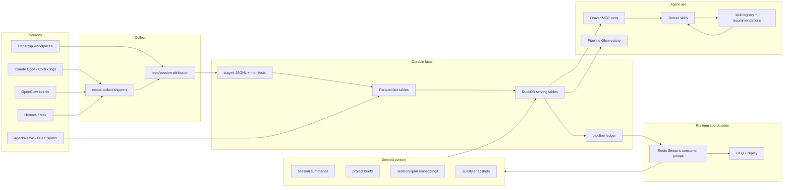

# Drover Pipeline Roadmap

Status: active roadmap  
Date: 2026-06-20

Note: this file keeps its original `nexus-pipeline-roadmap.md` path until the
public-release documentation sweep decides whether to rename historical links.

## Goal

Drover is moving from a reliable local context store into a visible, adopted,
self-improving agent context pipeline.

The near-term goal is not to add more background magic. The goal is to make the
pipeline understandable enough that Arnab can inspect it before an interview,
trust it during agent handoffs, and eventually publish the project without
private dogfood assumptions leaking into the open-source shape.

## Target Pipeline

## Tracks

### 1. Pipeline Reliability

Current status: recovered from critical to warning-level quality.

Delivered:

- Pipeline ledger and replay/reconcile paths.
- Bounded quality diagnostics.
- DuckDB OOM hardening.
- Redis job stream adapter.
- Stream-coordinated summarizer, brief, session embedding, and span embedding
  workers.
- Completion contract for Paperclip-delegated Drover work.

Still open:

- [#151](https://github.com/arniesaha/nexus/issues/151): production Redis
  worker startup, runtime config, operator commands, DLQ/replay acceptance.

### 2. Pipeline Observatory

Tracking issue: [#176](https://github.com/arniesaha/nexus/issues/176)

Arnab should be able to answer these without reading logs or querying DuckDB:

- What arrived in the last hour?
- Which sources are stale?
- Which pipeline stages are queued, running, done, or errored?
- Which summaries and briefs were saved, by model and timestamp?
- Which project is handoff-ready?
- Which DLQ entries need operator action?

Initial implementation is a read-only JSON/CLI surface plus Grafana-friendly
metrics. `nexus-server observatory` and `nexus_pipeline_observatory` expose the
saved summary/brief artifacts and project-readiness drilldown; Prometheus covers
the aggregate health and adoption gauges. A custom UI can come after the metrics
shape is stable.

### 3. Agent Adoption

Tracking issue: [#179](https://github.com/arniesaha/nexus/issues/179)

Every active agent should have two independent capabilities:

- It emits events/spans that Nexus can attribute.
- It can call Nexus MCP tools and knows when to use them.

The first deliverable is an adoption matrix in
[`agent-adoption.md`](agent-adoption.md), followed by smoke tests for OpenClaw
main, Max/Mac Mini, Paperclip agents, and Codex/Claude-style CLI sessions.

### 4. Meta Harness / Mobile CLI Control

Tracking issue: [#192](https://github.com/arniesaha/nexus/issues/192)

Drover should grow a phone-friendly Meta Harness surface for Arnab's personal
agent fleet:

- host registry for NAS, Mac Mini, and GPU PC
- per-host `drover-harnessd` daemon for PTY/tmux-backed local CLI sessions
- WebSocket terminal attach/input/resize/detach from the Drover UI
- launch presets for shell, Claude Code, Codex, Gemini, and OpenClaw
- transcript chunks and lifecycle events persisted into Drover
- session summaries and handoff bundles for continuing work in another harness

The design is scoped in [`meta-harness-mvp.md`](meta-harness-mvp.md), with an
agentic implementation plan in
[`superpowers/plans/2026-06-21-meta-harness-mvp.md`](superpowers/plans/2026-06-21-meta-harness-mvp.md).

This keeps the boundary crisp: Drover is the control/context plane; per-host
daemons are the terminal data plane.

### 5. Redis Interview Learning Track

Drover is now a practical Redis case study:

- Streams are the work queues.
- Consumer groups represent worker ownership.
- Pending Entries Lists model in-flight work.
- `XAUTOCLAIM` handles abandoned work.
- DLQ streams preserve poison messages and replay context.
- DuckDB/Parquet remain durable truth, so Redis is coordination, not storage.

The interview story should emphasize at-least-once delivery with idempotent
effects, not "Redis makes it exactly once."

The Meta Harness extends this story with a second Redis pattern: Redis Streams
coordinate host/session control events, heartbeats, leases, retries, and DLQ,
while WebSockets carry hot terminal bytes and DuckDB stores durable context.

### 6. Self-Learning Loop

Tracking issue: [#178](https://github.com/arniesaha/nexus/issues/178)

Once agents reliably emit and consume Drover context, Drover can observe which
skills, MCP tools, and context bundles are useful. The first loop is passive:

- inventory agent capabilities
- record tool/skill use in successful sessions
- connect project briefs and decisions to reusable skills
- generate recommendations for humans to approve

Automatic installation, public publishing, and cross-agent sync must stay behind
explicit approval.

### 7. Open-Source Readiness

Tracking issue: [#177](https://github.com/arniesaha/nexus/issues/177)

Before publishing:

- sanitize personal paths, hostnames, examples, and private operational notes
- create a clean public repo seed or reset history
- provide a demo dataset
- keep private dogfood runbooks out of the public tree
- preserve the local-first architecture and install path

Context-standard adoption for the public-release boundary is tracked
separately in
[`context-standards-roadmap.md`](context-standards-roadmap.md). That roadmap
covers OKF, Agent Behavior, Graphify, MCP, OpenTelemetry GenAI, W3C PROV, and
A2A, and separates first-public-release scope from post-release research.

The public release blocker checklist is tracked in
[`public-release-checklist.md`](public-release-checklist.md).

### 8. Vortex / Trace Lake Spike

Tracking issue: [#154](https://github.com/arniesaha/nexus/issues/154)

This is later research. The current answer remains: keep OTLP/Tempo-compatible
hot tracing and test Vortex/Parquet-style object storage as a cold analytical
trace lake.

## Current Reliability Snapshot

Latest Mac Mini dogfood validation, 2026-06-20:

- Overall quality: `warn`, score `0.65`.
- Freshness: OK.
- Incoming backlog: `0`.
- Summary coverage: `99.7%`.
- Summarize queue: `pending=0`, `retryable_errors=0`.
- Remaining summarize errors: `3` terminal local-model validation misses.
- Session embeddings: `1790/1790`, `100%`.
- Span embeddings: `99.9%`, pending `0`, stale running `0`.
- Session audit: clean.
- Ledger stale lease dry-run: zero stale leases.

The pipeline is stable enough to build the observability/adoption layer. It is
not yet complete enough to close #151 as a production Redis cutover.
